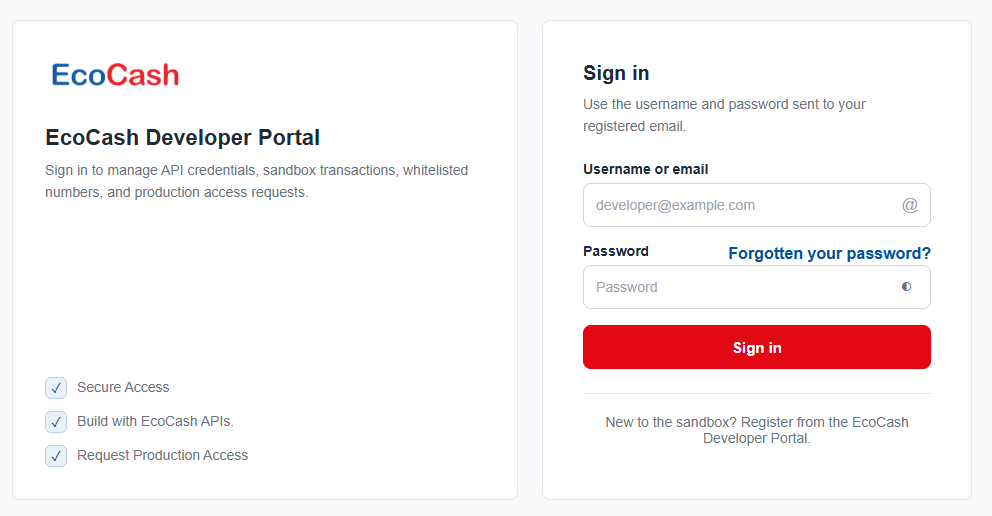
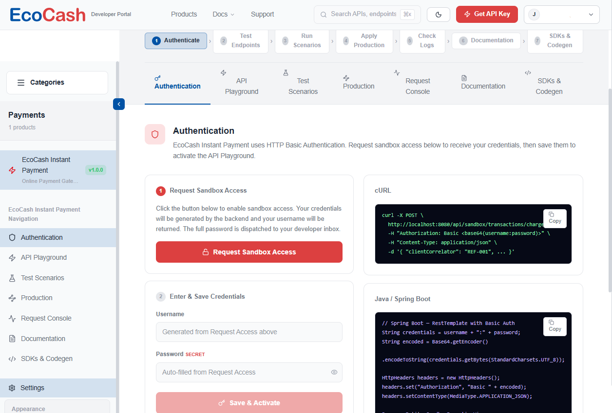
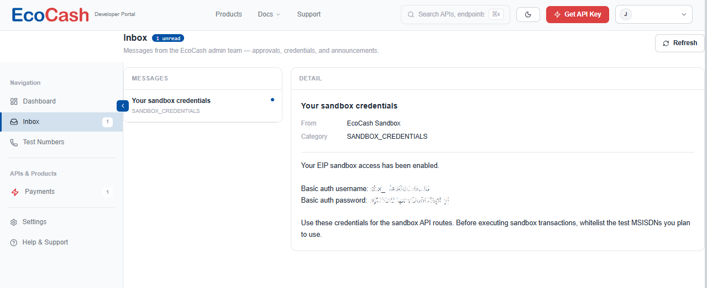
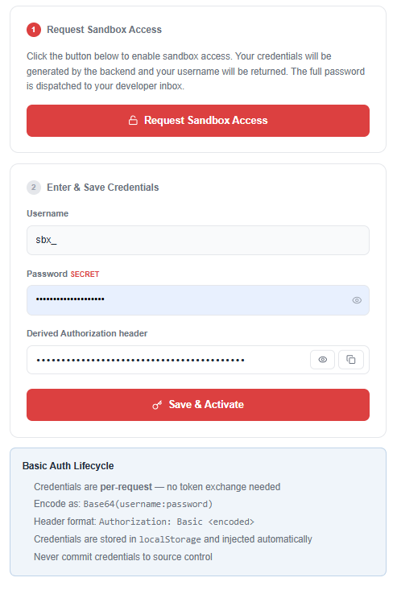
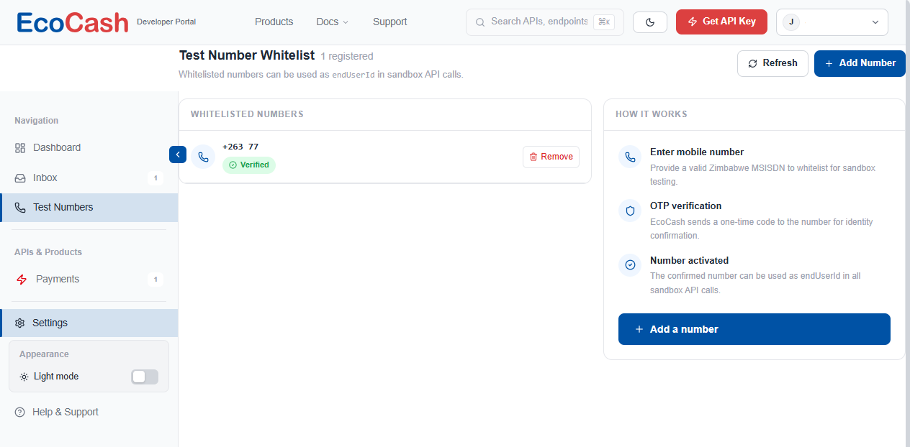

<p align="center">
  <a href="https://developers.ecocash.co.zw/portal">
    
  </a>
</p>

<h1 align="center">EcoCash Instant Payment (EIP) API — Developer Guide</h1>

<p align="center">
  <strong>A clear, step-by-step guide to integrating EcoCash Instant Payment: get sandbox access, charge an EcoCash wallet, check the result, refund it, and go live. Examples in cURL, PHP/Laravel, Node.js, Python, Java and C#.</strong>
</p>

<p align="center">
  <a href="https://67even.github.io/ecocash-instant-payment-api/"></a>
  <a href="#12-claude-skill"></a>
  <a href="https://github.com/67even/ecocash-instant-payment-api/releases/latest"></a>
  <a href="LICENSE"></a>
  
  
  
  
  
  
  
  <a href="https://github.com/67even/ecocash-instant-payment-api/actions/workflows/tests.yml"></a>
</p>

<p align="center">
  <a href="https://67even.github.io/ecocash-instant-payment-api/"><strong>Read the documentation site →</strong></a>
  &nbsp;·&nbsp;
  <a href="#12-claude-skill"><strong>Install the Claude skill →</strong></a>
</p>

> **Independent guide.** This is a community-maintained guide written from the EcoCash
> Developer Portal. It is not affiliated with, endorsed by, or supported by EcoCash Holdings
> Zimbabwe. For official support, contact EcoCash (see [Getting help](#103-getting-help)).

---

## Contents

1. [Overview](#1-overview)
2. [Get sandbox access](#2-get-sandbox-access)
3. [Authentication](#3-authentication)
4. [Your first payment](#4-your-first-payment)
5. [API reference](#5-api-reference)
6. [Statuses and errors](#6-statuses-and-errors)
7. [Testing in the sandbox](#7-testing-in-the-sandbox)
8. [SDKs and code examples](#8-sdks-and-code-examples)
9. [Going live](#9-going-live)
10. [Troubleshooting](#10-troubleshooting)
11. [Known portal inconsistencies](#11-known-portal-inconsistencies)
12. [Claude skill](#12-claude-skill)
13. [About this repository](#13-about-this-repository)

---

## 1. Overview

**EcoCash Instant Payment (EIP)** is EcoCash's online payment gateway. Your server asks
EcoCash to charge a customer's EcoCash wallet. EcoCash sends the customer a **USSD PIN
prompt** on their phone, the customer approves with their EcoCash PIN, and you get the result
by callback or by looking the transaction up.

### 1.1 What you can do

| Operation | Endpoint | Use it to |
|---|---|---|
| **Charge** | `POST /transactions/amount/` | Request a payment from a customer's EcoCash wallet |
| **Look up** | `GET /{endUserId}/transactions/amount/{clientCorrelator}` | Get the current status of a charge |
| **Refund / reverse** | `POST /transactions/refund/` | Return money for a completed payment |

### 1.2 How a payment works

```text
 Your server                     EcoCash EIP                     Customer's phone
     │  1. POST /transactions/amount/  │                                 │
     │ ──────────────────────────────▶ │  2. USSD PIN prompt             │
     │  ◀── 200 OK, status: PENDING ── │ ──────────────────────────────▶ │
     │                                 │  3. Customer enters PIN         │
     │                                 │ ◀────────────────────────────── │
     │  4a. Callback to your notifyUrl │                                 │
     │ ◀────────────────────────────── │  5. SMS with the outcome        │
     │  4b. …or poll GET lookup        │ ──────────────────────────────▶ │
     │ ──────────────────────────────▶ │                                 │
     │  ◀── status: SUCCESS / FAILED ─ │                                 │
```

A charge is **asynchronous**. The first response only means *accepted*. The payment
succeeds or fails later, when the customer responds to the PIN prompt.

### 1.3 Quick facts

| | |
|---|---|
| **Sandbox base URL** | `https://developers.ecocash.co.zw/sandbox/payment/v1` |
| **Authentication** | HTTP Basic: `Authorization: Basic base64(username:password)` |
| **Format** | HTTPS / REST, `Content-Type: application/json` |
| **Transaction types** (`tranType`) | `MER` merchant charge · `REF` refund · `REV` reversal |
| **Currencies** | `USD`, `ZWG` |
| **Rate limit** | 500 requests per minute |
| **Version** | v1.0.0 (Stable) |
| **Developer portal** | <https://developers.ecocash.co.zw/portal> |

The sandbox simulates every transaction. **No real money moves.**

### 1.4 The integration path

1. [Get sandbox access](#2-get-sandbox-access). Register, request credentials, and verify a
   test number.
2. [Set up authentication](#3-authentication) with the credentials from your portal Inbox.
3. [Make your first payment](#4-your-first-payment): charge, check the status, refund.
4. [Build it into your app](#8-sdks-and-code-examples) using the language examples.
5. [Test every scenario](#7-testing-in-the-sandbox) with the sandbox PIN matrix.
6. [Go live](#9-going-live): submit your test evidence and get production credentials.

---

## 2. Get sandbox access

Before your first API call you need a developer portal account, sandbox credentials, and a
verified test number. This takes about ten minutes.

| Step | Where in the portal | What you get |
|---|---|---|
| 2.1 | Sign-in page | A developer portal session |
| 2.2 | EcoCash Instant Payment → **Authentication** | Your sandbox username |
| 2.3 | **Inbox** → *Your sandbox credentials* | Your username and password |
| 2.4 | EcoCash Instant Payment → **Authentication** | The `Authorization` header, with the sandbox activated |
| 2.5 | **Test Numbers** | A verified EcoCash number to test with |

### 2.1 Register and sign in

Register on the [EcoCash Developer Portal](https://developers.ecocash.co.zw/portal), then
sign in with the **username (or email) and password sent to your registered email**.



### 2.2 Request sandbox access

1. From **Products**, open **EcoCash Instant Payment** (under *Payments*).
2. Open the **Authentication** tab (step **1 — Authenticate** in the progress bar).
3. Under **1 · Request Sandbox Access**, click **Request Sandbox Access**.

Your **username** is returned straight away. Your **password is sent to your portal Inbox**.



> **Don't copy the cURL sample on this page.** It points to a local development address
> (`http://localhost:8080/api/sandbox/transactions/charges`). Use the sandbox base URL from
> [Quick facts](#13-quick-facts) instead.

### 2.3 Collect your credentials from the Inbox

1. Open **Inbox** in the left navigation.
2. Open **"Your sandbox credentials"**. It comes from *EcoCash Sandbox* and its category is
   `SANDBOX_CREDENTIALS`.
3. Copy the **Basic auth username** (it starts with `sbx_`) and the **Basic auth password**.



> 🔒 **These are secrets.** Keep them in environment variables or a secret manager. Never
> commit them, and never ship them to a browser or mobile app.

### 2.4 Save & activate to get the Authorization header

1. Go back to **EcoCash Instant Payment → Authentication**.
2. Under **2 · Enter & Save Credentials**, paste the username and password.
3. The **Derived Authorization header** fills in automatically. Use the eye icon to see it and
   the copy icon to copy it.
4. Click **Save & Activate**.



### 2.5 Verify a test number

Once your credentials are saved and the header has been generated, **request verification for
a test number**. A test number is an **EcoCash-registered mobile number you control**. It acts
as the customer: you send it as `endUserId` in a charge, and that phone receives the payment
prompt. **Only whitelisted, verified numbers can be charged in the sandbox.**

1. Open **Test Numbers** in the portal's main left navigation (not the product sidebar).
2. Click **Add Number** and enter the Zimbabwe MSISDN, e.g. `263771234567`.
3. EcoCash sends a **one-time code (OTP)** to that number. Enter it.
4. The number appears with a **Verified** badge and is ready to use as `endUserId`.



**Checkpoint:** you now have a username, a password, an `Authorization` header and a
verified test number. Continue to [Authentication](#3-authentication).

---

## 3. Authentication

Every request uses **HTTP Basic authentication**. There is no token exchange, no expiry, and
no refresh step: you send the same header on every call.

### 3.1 Build the header

1. Join your username and password with a colon: `username:password`.
2. Base64-encode that string.
3. Send it as `Authorization: Basic <encoded>`.

```bash
# Build the header yourself (it matches the portal's "Derived Authorization header")
printf '%s' 'sbx_yourusername:yourpassword' | base64
```

```bash
# Or let curl do it with -u
curl -u "$EIP_USERNAME:$EIP_PASSWORD" \
  'https://developers.ecocash.co.zw/sandbox/payment/v1/{endUserId}/transactions/amount/{clientCorrelator}'
```

### 3.2 Store credentials safely

Keep every EIP value in configuration, never in code:

```dotenv
# .env — never commit this file
EIP_BASE_URL=https://developers.ecocash.co.zw/sandbox/payment/v1
EIP_USERNAME=sbx_yourusername
EIP_PASSWORD=your_password

# Merchant values: copy them from your portal's Authentication tab → Credential Reference
EIP_MERCHANT_CODE=287164
EIP_MERCHANT_PIN=1234
EIP_MERCHANT_NUMBER=778503033
EIP_TERMINAL_ID=TERM001
EIP_MERCHANT_NAME="Test Merchant"
EIP_SUPER_MERCHANT_NAME="EcoCash Sandbox"
EIP_CHANNEL=WEB
EIP_LOCATION=Harare

# Refund transaction type: REF (refund) or REV (reversal). See section 4.5.
EIP_REFUND_TRAN_TYPE=REF
```

> **Which merchant values?** The portal publishes two sandbox merchant sets. Use the one on
> **your** Authentication tab's *Credential Reference* (it matches what the API Playground
> sends). The other set, from the Documentation tab's Test Data, is listed in
> [Sandbox merchant values](#73-sandbox-merchant-values).

### 3.3 Authentication errors

| HTTP | Code | Meaning | Fix |
|---|---|---|---|
| `401` | `E006` | Header missing, malformed, or wrong username/password | Re-copy both values from the Inbox and rebuild the header |
| `403` | `E007` | Sandbox not enabled | Click **Request Sandbox Access**, then **Save & Activate** |

---

## 4. Your first payment

Do this once by hand with cURL before writing any code. You'll charge a test number,
approve it on the phone, check the result and refund it.

Set these first. Use a **verified** test number from [step 2.5](#25-verify-a-test-number):

```bash
export EIP=https://developers.ecocash.co.zw/sandbox/payment/v1
export EIP_AUTH="sbx_yourusername:yourpassword"
export MSISDN=263771234567        # your verified test number
export CORR=$(date +%s)            # a unique clientCorrelator
```

### 4.1 Step 1: Charge the customer

```bash
curl -sS -X POST "$EIP/transactions/amount/" \
  -u "$EIP_AUTH" \
  -H 'Content-Type: application/json' \
  -d '{
    "clientCorrelator": "'"$CORR"'",
    "notifyUrl": "",
    "referenceCode": "ORDER-'"$CORR"'",
    "tranType": "MER",
    "endUserId": "'"$MSISDN"'",
    "remarks": "Test payment",
    "transactionOperationStatus": "Charged",
    "paymentAmount": {
      "charginginformation": { "amount": "2.00", "currency": "USD", "description": "Test payment" },
      "chargeMetaData": { "channel": "WEB" }
    },
    "merchantCode": "287164",
    "merchantPin": "1234",
    "merchantNumber": "778503033",
    "countryCode": "ZW",
    "terminalID": "TERM001",
    "location": "Harare",
    "superMerchantName": "EcoCash Sandbox",
    "merchantName": "Test Merchant"
  }'
```

You get `200 OK` with `"status": "PENDING"`, which means the charge was **accepted, not yet
paid**. (The responses in this section are the portal's documented examples, so their values
won't match your request.)

```json
{
  "transactionId": "MP230422.1145.T0123456",
  "clientCorrelator": "1774252612",
  "status": "PENDING",
  "statusCode": "200",
  "amount": 2,
  "currency": "USD",
  "endUserId": "773047653",
  "merchantCode": "001535",
  "timestamp": "2024-04-22T11:45:30Z"
}
```

**Save the `transactionId`.** You need it to refund this payment.

### 4.2 Step 2: Approve on the phone

The test phone gets a USSD prompt. Enter a **sandbox test PIN** to choose the outcome:

| PIN | Outcome |
|---|---|
| `0000` | ✅ Successful payment |
| `1111` | ⚠️ Insufficient balance |
| `2222` | ❌ Invalid PIN |
| `9999` | 🚫 Transaction limit exceeded |

Use `0000` now. The merchant PIN in the request body (`1234`) never changes.

### 4.3 Step 3: Check the status

```bash
curl -sS "$EIP/$MSISDN/transactions/amount/$CORR" -u "$EIP_AUTH"
```

```json
{
  "transactionId": "MP230422.1145.T0123456",
  "clientCorrelator": "1774252612",
  "status": "SUCCESS",
  "statusCode": "200",
  "endUserId": "773047653",
  "amount": 2,
  "currency": "USD",
  "merchantCode": "001535",
  "merchantName": "UAT STORE 3",
  "referenceCode": "TEST_1774252612",
  "timestamp": "2024-04-22T11:45:30Z",
  "description": "UAT STORE 3"
}
```

Repeat every few seconds until `status` is no longer `PENDING`. Sandbox transactions usually
resolve within **12–30 seconds**. The phone also gets an SMS starting `SANDBOX TEST:`.

### 4.4 Step 4: Refund it

Refunds need a **new** `clientCorrelator` and the **original EcoCash reference** (the
`transactionId` from step 1). Only a `SUCCESS` payment can be refunded.

```bash
export REFUND_CORR=$(date +%s)
export ORIGINAL_REF=MP230422.1145.T0123456   # transactionId from step 1

curl -sS -X POST "$EIP/transactions/refund/" \
  -u "$EIP_AUTH" \
  -H 'Content-Type: application/json' \
  -d '{
    "clientCorrelator": "'"$REFUND_CORR"'",
    "referenceCode": "REFUND-'"$REFUND_CORR"'",
    "tranType": "REF",
    "endUserId": "'"$MSISDN"'",
    "originalEcocashReference": "'"$ORIGINAL_REF"'",
    "remarks": "Customer refund",
    "paymentAmount": {
      "charginginformation": { "amount": "2.00", "currency": "USD", "description": "Refund" },
      "chargeMetaData": { "channel": "WEB" }
    },
    "merchantCode": "287164",
    "merchantPin": "1234",
    "merchantNumber": "778503033",
    "countryCode": "ZW",
    "terminalID": "TERM001",
    "location": "Harare",
    "superMerchantName": "EcoCash Sandbox",
    "merchantName": "Test Merchant"
  }'
```

```json
{
  "transactionId": "RF230422.1200.R0123456",
  "clientCorrelator": "1774252613",
  "status": "SUCCESS",
  "statusCode": "200",
  "statusMessage": "Refund processed successfully",
  "originalReference": "MP230422.1145.T0123456",
  "amount": 2,
  "currency": "USD",
  "timestamp": "2024-04-22T12:00:15Z"
}
```

**Done.** You've run the full payment lifecycle. Now
[confirm three details](#45-confirm-three-details-in-your-first-run), then build it into your
app with the [code examples](#8-sdks-and-code-examples).

### 4.5 Confirm three details in your first run

The portal's pages disagree on three details. Your first sandbox run settles them. Keep each
one as a single config value in your code (the examples in section 8 do) so you can switch it
without a rewrite.

| Detail | Try first | If the sandbox rejects it |
|---|---|---|
| `amount` format | String with two decimals, `"2.00"` (what the Playground and SDK samples send) | A JSON number, `2` (what the Documentation examples show) |
| Refund `tranType` | `"REF"` for a refund, `"REV"` for a reversal (the Documentation) | `"MER"` plus a top-level `"currencyCode"` (what the Playground and SDK samples send) |
| Merchant values | Your Authentication tab's *Credential Reference* set | The Documentation's Test Data set ([7.3](#73-sandbox-merchant-values)) |

Background on each is in [Known portal inconsistencies](#11-known-portal-inconsistencies).

---

## 5. API reference

**Base URL:** `https://developers.ecocash.co.zw/sandbox/payment/v1`
**Headers on every request:** `Authorization: Basic <encoded>` and
`Content-Type: application/json`

> **Keep the trailing slashes exactly as shown.** `/transactions/amount/` and
> `/transactions/refund/` end with `/`; the lookup path does not. Some gateways treat `/x` and
> `/x/` as different routes.

### 5.1 Charge request

```http
POST /transactions/amount/
```

Asks EcoCash to charge a customer's wallet. The customer gets a USSD PIN prompt to approve.

#### Request fields

| Field | Type | Required | Description |
|---|---|---|---|
| `clientCorrelator` | string | ✅ | **Your** unique ID for this transaction. Never reuse it. You need it for lookups. |
| `referenceCode` | string | ✅ | Your own reference, e.g. an order or invoice number. It appears in the customer's SMS. |
| `tranType` | string | ✅ | `MER` for a merchant charge |
| `endUserId` | string | ✅ | Customer's EcoCash number (MSISDN), e.g. `263771234567` |
| `paymentAmount.charginginformation.amount` | decimal | ✅ | Amount to charge, positive, at most 2 decimal places |
| `paymentAmount.charginginformation.currency` | string | ✅ | `USD` or `ZWG` |
| `paymentAmount.charginginformation.description` | string | ✅ | What the payment is for |
| `paymentAmount.chargeMetaData.channel` | string | ✅ | Sales channel, e.g. `WEB` or `POS` |
| `merchantCode` | string | ✅ | Your EcoCash merchant code |
| `merchantPin` | string | ✅ | Your merchant PIN (a secret: redact it in logs) |
| `merchantNumber` | string | ✅ | Your merchant's registered MSISDN |
| `terminalID` | string | ✅ | Terminal identifier, e.g. `TERM001` |
| `countryCode` | string | ✅ | `ZW` |
| `location` | string | ✅ | Merchant location, e.g. `Harare` |
| `superMerchantName` | string | ✅ | Parent merchant name |
| `merchantName` | string | ✅ | Merchant name shown to the customer in the SMS |
| `remarks` | string | ✅ | Free-text remarks |
| `transactionOperationStatus` | string | ✅ | Always `"Charged"` |
| `notifyUrl` | string | optional | HTTPS URL for status callbacks (`""` if none) |

The "Required" column reflects the documented request body, where every field is present.
The portal only marks a subset as "key" fields.

> ⚠️ **Watch the unusual spelling.** Copy these exactly:
> **`charginginformation`** (all lowercase), **`chargeMetaData`** (capital M and D),
> **`terminalID`** (capital ID). Serialisers that "fix" casing break the request.

#### Request body

```json
{
  "clientCorrelator": "1774252612",
  "notifyUrl": "",
  "referenceCode": "TEST_1774252612",
  "tranType": "MER",
  "endUserId": "773047653",
  "remarks": "EcoCash Sandbox",
  "transactionOperationStatus": "Charged",
  "paymentAmount": {
    "charginginformation": {
      "amount": 2,
      "currency": "USD",
      "description": "UAT STORE 3"
    },
    "chargeMetaData": {
      "channel": "POS"
    }
  },
  "merchantCode": "001535",
  "merchantPin": "1234",
  "merchantNumber": "788732685",
  "countryCode": "ZW",
  "terminalID": "UAT00003",
  "location": "Harare",
  "superMerchantName": "ECOCASH",
  "merchantName": "UAT STORE 3"
}
```

#### Response

```json
{
  "transactionId": "MP230422.1145.T0123456",
  "clientCorrelator": "1774252612",
  "status": "PENDING",
  "statusCode": "200",
  "statusMessage": "Transaction Successful",
  "amount": 2,
  "currency": "USD",
  "endUserId": "773047653",
  "merchantCode": "001535",
  "timestamp": "2024-04-22T11:45:30Z"
}
```

| Field | Meaning |
|---|---|
| `transactionId` | EcoCash's reference for this transaction. **Store it**: refunds need it as `originalEcocashReference`. |
| `status` | `PENDING` right after a charge. **Branch on this**, not on `statusMessage`. |
| `statusCode` | A **string**, e.g. `"200"` |
| `statusMessage` | Human-readable text. In the documented example it says "Transaction Successful" even while `status` is `PENDING`, so don't trust it on its own. |

#### HTTP status codes

| Code | Meaning |
|---|---|
| `200` | Accepted. Check `status` for the outcome. |
| `400` | Invalid request parameters |
| `401` | Unauthorized. Check your Basic Auth credentials. |
| `422` | Business rule violation (e.g. barred number) |
| `500` | Internal server error |

Also handle `403`, `404`, `409` and `503`. See [Error codes](#62-error-codes).

### 5.2 Transaction lookup

```http
GET /{endUserId}/transactions/amount/{clientCorrelator}
```

Returns the current state of a charge. Use it to poll for the outcome, or to confirm a
callback before acting on it.

#### Path parameters

| Parameter | Description |
|---|---|
| `endUserId` | The customer MSISDN you sent in the charge |
| `clientCorrelator` | The `clientCorrelator` you sent in the charge (the portal's Overview calls it `{correlator}`; it is the same value) |

#### Response

```json
{
  "transactionId": "MP230422.1145.T0123456",
  "clientCorrelator": "1774252612",
  "status": "SUCCESS",
  "statusCode": "200",
  "endUserId": "773047653",
  "amount": 2,
  "currency": "USD",
  "merchantCode": "001535",
  "merchantName": "UAT STORE 3",
  "referenceCode": "TEST_1774252612",
  "timestamp": "2024-04-22T11:45:30Z",
  "description": "UAT STORE 3"
}
```

#### HTTP status codes

| Code | Meaning |
|---|---|
| `200` | Transaction details returned |
| `401` | Unauthorized |
| `404` | No transaction for this `endUserId` + `clientCorrelator` |

### 5.3 Refund or reversal

```http
POST /transactions/refund/
```

Returns money for a **completed (`SUCCESS`)** payment. Use `tranType` **`REF`** for a customer
refund or **`REV`** for a merchant reversal.

#### Request fields

The body has the same shape as a charge, plus `originalEcocashReference`:

| Field | Type | Required | Description |
|---|---|---|---|
| `clientCorrelator` | string | ✅ | A **new** unique ID for the refund, never the original charge's |
| `originalEcocashReference` | string | ✅ | The original charge's EcoCash reference (its `transactionId`) |
| `tranType` | string | ✅ | `REF` (refund) or `REV` (reversal). See [4.5](#45-confirm-three-details-in-your-first-run). |
| `paymentAmount.charginginformation.amount` | decimal | ✅ | Must not exceed the original amount |
| *other fields* | | ✅ | `referenceCode`, `endUserId`, `paymentAmount…`, merchant fields, as in [5.1](#51-charge-request) |

> The Documentation tab's example refund body leaves out `originalEcocashReference`, but the
> field table and the Playground both make it **required**. Always send it.

#### Response

```json
{
  "transactionId": "RF230422.1200.R0123456",
  "clientCorrelator": "1774252613",
  "status": "SUCCESS",
  "statusCode": "200",
  "statusMessage": "Refund processed successfully",
  "originalReference": "MP230422.1145.T0123456",
  "amount": 2,
  "currency": "USD",
  "timestamp": "2024-04-22T12:00:15Z"
}
```

In the response the original reference comes back as **`originalReference`**, not
`originalEcocashReference`.

#### HTTP status codes

| Code | Meaning |
|---|---|
| `200` | Refund/reversal accepted |
| `400` | Invalid request |
| `404` | Original transaction not found |
| `409` | Transaction not eligible (e.g. already refunded, or not `SUCCESS`) |
| `422` | Refund amount exceeds the original payment |

### 5.4 Callbacks (notifyUrl)

Put an HTTPS URL in `notifyUrl` on a charge or refund to receive callbacks when the
transaction changes state. The portal doesn't publish the callback payload or its retry
policy, so handle callbacks defensively:

1. **Verify before acting.** Treat a callback as a hint. Confirm the status with a
   [lookup](#52-transaction-lookup) before you fulfil an order.
2. **Validate the signature.** The portal's Terms of Use require you to validate the HMAC
   signature included with each webhook. Ask EcoCash for the header name and secret.
3. **Be idempotent.** Delivery order and timing aren't guaranteed, and duplicates can arrive.
   Process each `clientCorrelator` once.
4. **Respond fast** with `200`, then do the work in a background job.

---

## 6. Statuses and errors

### 6.1 Transaction statuses

| `status` | Final? | What to do |
|---|---|---|
| `PENDING` | No | Wait for the callback, or poll the lookup |
| `SUCCESS` | Yes | Fulfil the order |
| `FAILED` | Yes | Show the failure. The reason is in `statusMessage`. |
| *anything else* | Treat as not final | Keep checking. After your timeout, flag it for manual review. Never assume failure. |

**Rules that prevent lost or double payments:**

- **HTTP `200` means accepted, not paid.** Every sandbox PIN outcome, including failures,
  returns `200`. The result is in the body.
- **Branch on `status`**, not on `statusMessage`.
- **Never resend a charge after a timeout.** Look it up with the same `clientCorrelator`
  first. A timed-out request may have reached the customer's phone.
- **Save the `clientCorrelator` before you send the charge**, so you can always look it up.

### 6.2 Error codes

Every error returns a JSON body with `statusCode` and `statusMessage`. Log both.

| Code | HTTP | Error | Fix | Retry? |
|---|---|---|---|---|
| `E001` | 400 | Missing required field | Send every field in the [request body](#51-charge-request) | No |
| `E002` | 400 | Invalid MSISDN format | Use a valid Zimbabwe number, e.g. `263771234567` | No |
| `E003` | 400 | Invalid currency | Use `USD` or `ZWG` | No |
| `E004` | 400 | Invalid amount | Positive, at most 2 decimal places | No |
| `E005` | 400 | Duplicate correlator | Generate a new unique `clientCorrelator` | No |
| `E006` | 401 | Invalid credentials | Check the `Authorization` header | No |
| `E007` | 403 | Sandbox not enabled | Request Sandbox Access, then Save & Activate | No |
| `E008` | 404 | Transaction not found | Check `endUserId` + `clientCorrelator` | No |
| `E009` | 409 | Refund not eligible | Only `SUCCESS` transactions not already refunded | No |
| `E010` | 422 | Insufficient funds | Customer's balance is too low (sandbox: PIN `1111`) | No |
| `E011` | 422 | Barred MSISDN | The number can't transact | No |
| `E012` | 422 | Refund exceeds original | Refund at most the original amount | No |
| `E013` | 422 | Limit exceeded | Wallet limit reached (sandbox: PIN `9999`) | No |
| `E014` | 500 | Internal server error | Retry with exponential backoff; contact support if it persists | **Yes** |
| `E015` | 503 | Service unavailable | Sandbox maintenance; retry after the window | **Yes** |

> **Only `500` and `503` are worth retrying.** The `4xx` errors fail the same way every
> time. Fix the request, credentials or state first.

The portal doesn't publish which `statusCode` value comes with each `Exxx` code, so match on
the HTTP status and `statusMessage`. An invalid customer PIN (sandbox PIN `2222`) has no `Exxx`
code at all. Detect it from `statusMessage`.

### 6.3 Rate limit

The API allows **500 requests per minute**. The response to exceeding it isn't documented.
Treat a `429` as "back off and retry later", and don't poll faster than every 3 seconds.

---

## 7. Testing in the sandbox

### 7.1 PIN test matrix

When a charge reaches the test phone, the PIN you enter decides the outcome:

| PIN | Scenario | HTTP | `statusMessage` |
|---|---|---|---|
| `0000` | ✅ Successful transaction | 200 OK | Transaction Successful |
| `1111` | ⚠️ Insufficient funds | 200 OK | Insufficient Balance |
| `2222` | ❌ Incorrect PIN | 200 OK | Transaction Failed - Invalid PIN |
| `9999` | 🚫 Limit exceeded | 200 OK | Transaction Limit Exceeded |

The **customer** enters these PINs. Your **merchant** PIN in the request body stays `1234`.
The Error Reference maps PINs `1111` and `9999` to `422` errors (`E010` and `E013`), so handle
both a `200` failure and a `422`.

### 7.2 Test numbers

- Only **whitelisted, OTP-verified** numbers can be charged or receive sandbox SMS
  ([step 2.5](#25-verify-a-test-number)).
- Accepted formats: `263XXXXXXXXX` or `07XXXXXXXX`, normalised automatically. **Use
  `263XXXXXXXXX`.** The portal's examples also show a 9-digit form (`773047653`) that the
  normalisation note doesn't mention.

### 7.3 Sandbox merchant values

The portal publishes two sets. Use the one on your Authentication tab (Set A) first.

| Field | Set A: Authentication tab, Playground, SDK samples | Set B: Documentation → Test Data |
|---|---|---|
| `merchantCode` | `287164` | `001535` |
| `merchantPin` | `1234` | `1234` |
| `merchantNumber` | `778503033` | `788732685` |
| `terminalID` | `TERM001` | `UAT00003` |
| `countryCode` | `ZW` | `ZW` |
| `location` | `Harare` | `Harare` |
| `superMerchantName` | `EcoCash Sandbox` | `ECOCASH` |
| `merchantName` | `Test Merchant` | `UAT STORE 3` |
| `channel` | `WEB` | `POS` |

### 7.4 SMS notifications

Every sandbox transaction, successful or failed, sends an SMS to the `endUserId`:

```text
SANDBOX TEST: Your EcoCash payment of USD [amount] to [merchantName] (Ref: [referenceCode]) was SUCCESSFUL. This is a test transaction.
SANDBOX TEST: Your EcoCash payment of USD [amount] to [merchantName] (Ref: [referenceCode]) FAILED. Reason: [failureReason]. This is a test transaction.
```

`[amount]` comes from `paymentAmount.charginginformation.amount`, `[merchantName]` and
`[referenceCode]` from your request, and `[failureReason]` from the response `statusMessage`.
The number must be whitelisted to receive it.

### 7.5 Portal testing tools

| Tool | Where | What it does |
|---|---|---|
| **API Playground** | Product tab 2 | Send charge, lookup and refund requests from a form. Its **cURL** view shows the exact request. Its lookup can poll every 3 s. |
| **Test Scenarios** | Product tab 3 | Pre-built end-to-end flows. *Full Happy Path*: charge ZWG 75.00, poll until SUCCESS, verify. *Initiate + Refund*: charge ZWG 20.00, wait for SUCCESS, refund in full. *Auth Failure Handling*: wrong credentials and no header (expect `401` both times), then correct credentials. *Validation & Edge Cases*: missing `amount` (expect `400`), then a valid payment. |
| **Request Console** | Product tab 5 | A live log of every sandbox call: method, path, status, latency, and full request and response bodies. |

### 7.6 Test checklist

Run every case and record the result. These are the cases EcoCash's test script
([Going live](#9-going-live)) asks for:

| ID | API | PIN | Expected result |
|---|---|---|---|
| `TC-001` | Charge | `0000` | Transaction Successful |
| `TC-002` | Charge | `1111` | Insufficient Balance |
| `TC-003` | Charge | `2222` | Transaction Failed - Invalid PIN |
| `TC-004` | Charge | `9999` | Transaction Limit Exceeded |
| `TC-005` | Lookup | N/A | Transaction status returned |
| `TC-006` | Refund / reversal | N/A | Refund processed successfully |

Also test your own failure handling: a wrong password (`401`), a reused `clientCorrelator`,
a refund above the original amount (`422`), and a network timeout during a charge (look it up,
don't resend).

---

## 8. SDKs and code examples

The portal's **SDKs & Codegen** tab has samples for 5 languages × 3 HTTP clients. They're a
useful starting point, but several won't work as published (see [8.7](#87-pitfalls-in-the-portals-sdk-samples)).
The examples below are complete, minimal clients that avoid those problems. Each one:

- reads every value from configuration ([3.2](#32-store-credentials-safely))
- builds URLs by plain string joining, so `/sandbox/payment/v1` is never dropped
- sends the exact field names, including `charginginformation`, `chargeMetaData` and `terminalID`
- reads the status from `status`, falling back to the names the SDK samples use
- keeps the [three first-run details](#45-confirm-three-details-in-your-first-run) (amount
  format, refund `tranType`, merchant values) in one place

| Language | Client | Section |
|---|---|---|
| PHP / Laravel | Laravel `Http` facade | [8.1](#81-php--laravel) |
| JavaScript | Node.js 18+ `fetch` | [8.2](#82-nodejs) |
| Python | `requests` | [8.3](#83-python) |
| Java | Spring `RestClient` (Spring Boot 3.2+) | [8.4](#84-java--spring-boot) |
| C# | .NET 8 `HttpClient` | [8.5](#85-c--net) |

The full, verbatim portal samples for all 15 clients are in
[`reference/ECOCASH-EIP-SDK-REFERENCE.md`](reference/ECOCASH-EIP-SDK-REFERENCE.md).

### 8.1 PHP / Laravel

`config/services.php`:

```php
'ecocash' => [
    'base_url'            => env('EIP_BASE_URL', 'https://developers.ecocash.co.zw/sandbox/payment/v1'),
    'username'            => env('EIP_USERNAME'),
    'password'            => env('EIP_PASSWORD'),
    'merchant_code'       => env('EIP_MERCHANT_CODE'),
    'merchant_pin'        => env('EIP_MERCHANT_PIN'),
    'merchant_number'     => env('EIP_MERCHANT_NUMBER'),
    'terminal_id'         => env('EIP_TERMINAL_ID'),
    'merchant_name'       => env('EIP_MERCHANT_NAME'),
    'super_merchant_name' => env('EIP_SUPER_MERCHANT_NAME'),
    'channel'             => env('EIP_CHANNEL', 'WEB'),
    'location'            => env('EIP_LOCATION', 'Harare'),
    'refund_tran_type'    => env('EIP_REFUND_TRAN_TYPE', 'REF'),
],
```

`app/Services/EcoCash.php`:

```php
<?php

namespace App\Services;

use Illuminate\Http\Client\PendingRequest;
use Illuminate\Support\Facades\Http;
use Illuminate\Support\Str;

class EcoCash
{
    private function http(): PendingRequest
    {
        return Http::baseUrl(rtrim(config('services.ecocash.base_url'), '/'))
            ->withBasicAuth(config('services.ecocash.username'), config('services.ecocash.password'))
            ->acceptJson()
            ->asJson()
            ->timeout(30);
    }

    /** Fields every charge and refund carries. */
    private function merchant(): array
    {
        $c = config('services.ecocash');

        return [
            'merchantCode'      => $c['merchant_code'],
            'merchantPin'       => $c['merchant_pin'],
            'merchantNumber'    => $c['merchant_number'],
            'countryCode'       => 'ZW',
            'terminalID'        => $c['terminal_id'],
            'location'          => $c['location'],
            'superMerchantName' => $c['super_merchant_name'],
            'merchantName'      => $c['merchant_name'],
        ];
    }

    private function amount(string $amount, string $currency, string $description): array
    {
        return [
            'charginginformation' => [
                'amount'      => number_format((float) $amount, 2, '.', ''), // "2.00" - see section 4.5
                'currency'    => $currency,
                'description' => $description,
            ],
            'chargeMetaData' => ['channel' => config('services.ecocash.channel')],
        ];
    }

    /** Start a charge. Persist $correlator BEFORE calling this. */
    public function charge(string $msisdn, string $amount, string $currency, string $reference,
                           string $correlator, string $notifyUrl = ''): array
    {
        $payload = [
            'clientCorrelator'           => $correlator,
            'notifyUrl'                  => $notifyUrl,
            'referenceCode'              => $reference,
            'tranType'                   => 'MER',
            'endUserId'                  => $msisdn,
            'remarks'                    => $reference,
            'transactionOperationStatus' => 'Charged',
            'paymentAmount'              => $this->amount($amount, $currency, $reference),
        ] + $this->merchant();

        return $this->http()->post('/transactions/amount/', $payload)->throw()->json();
    }

    public function lookup(string $msisdn, string $correlator): array
    {
        return $this->http()
            ->get('/'.rawurlencode($msisdn).'/transactions/amount/'.rawurlencode($correlator))
            ->throw()->json();
    }

    public function refund(string $msisdn, string $originalReference, string $amount,
                           string $currency, string $reference): array
    {
        $payload = [
            'clientCorrelator'         => (string) Str::uuid(), // a NEW correlator
            'referenceCode'            => $reference,
            'tranType'                 => config('services.ecocash.refund_tran_type'),
            'endUserId'                => $msisdn,
            'originalEcocashReference' => $originalReference,
            'remarks'                  => $reference,
            'paymentAmount'            => $this->amount($amount, $currency, 'Refund'),
        ] + $this->merchant();

        return $this->http()->post('/transactions/refund/', $payload)->throw()->json();
    }

    /** The API documents `status`; the portal's SDK samples read two other names. */
    public static function status(array $body): ?string
    {
        return $body['status'] ?? $body['transactionStatus'] ?? $body['transactionOperationStatus'] ?? null;
    }

    /** The reference a refund needs as originalEcocashReference. */
    public static function reference(array $body): ?string
    {
        return $body['ecocashReference'] ?? $body['transactionId'] ?? null;
    }
}
```

Usage:

```php
$eip = app(\App\Services\EcoCash::class);

$correlator = (string) \Illuminate\Support\Str::uuid();
// save $correlator on the order first, then:
$res = $eip->charge('263771234567', '10.00', 'USD', 'ORDER-1001', $correlator,
                    route('ecocash.callback'));

$status = \App\Services\EcoCash::status($eip->lookup('263771234567', $correlator)); // PENDING → SUCCESS
```

`->throw()` turns `4xx`/`5xx` into an `Illuminate\Http\Client\RequestException`. Its
`$e->response->json()` holds `statusCode` and `statusMessage`.

### 8.2 Node.js

Node 18+ (built-in `fetch`), ES modules. `ecocash.js`:

```javascript
import { randomUUID } from 'node:crypto';

const cfg = {
  baseUrl: (process.env.EIP_BASE_URL ?? 'https://developers.ecocash.co.zw/sandbox/payment/v1').replace(/\/+$/, ''),
  auth: 'Basic ' + Buffer.from(`${process.env.EIP_USERNAME}:${process.env.EIP_PASSWORD}`).toString('base64'),
  refundTranType: process.env.EIP_REFUND_TRAN_TYPE ?? 'REF',
};

const merchant = () => ({
  merchantCode: process.env.EIP_MERCHANT_CODE,
  merchantPin: process.env.EIP_MERCHANT_PIN,
  merchantNumber: process.env.EIP_MERCHANT_NUMBER,
  countryCode: 'ZW',
  terminalID: process.env.EIP_TERMINAL_ID,
  location: process.env.EIP_LOCATION ?? 'Harare',
  superMerchantName: process.env.EIP_SUPER_MERCHANT_NAME,
  merchantName: process.env.EIP_MERCHANT_NAME,
});

const paymentAmount = (amount, currency, description) => ({
  charginginformation: { amount: Number(amount).toFixed(2), currency, description }, // "2.00" - section 4.5
  chargeMetaData: { channel: process.env.EIP_CHANNEL ?? 'WEB' },
});

async function eip(path, init = {}) {
  const res = await fetch(cfg.baseUrl + path, {
    ...init,
    headers: { Authorization: cfg.auth, 'Content-Type': 'application/json', Accept: 'application/json' },
    signal: AbortSignal.timeout(30_000),
  });
  const body = await res.json().catch(() => ({}));
  if (!res.ok) {
    const err = new Error(`EIP ${res.status}: ${body.statusMessage ?? 'request failed'}`);
    err.status = res.status;
    err.body = body;
    throw err;
  }
  return body;
}

/** Start a charge. Persist `correlator` BEFORE calling this. */
export function charge({ msisdn, amount, currency = 'USD', reference, correlator, notifyUrl = '' }) {
  return eip('/transactions/amount/', {
    method: 'POST',
    body: JSON.stringify({
      clientCorrelator: correlator,
      notifyUrl,
      referenceCode: reference,
      tranType: 'MER',
      endUserId: msisdn,
      remarks: reference,
      transactionOperationStatus: 'Charged',
      paymentAmount: paymentAmount(amount, currency, reference),
      ...merchant(),
    }),
  });
}

export function lookup(msisdn, correlator) {
  return eip(`/${encodeURIComponent(msisdn)}/transactions/amount/${encodeURIComponent(correlator)}`);
}

export function refund({ msisdn, originalReference, amount, currency = 'USD', reference }) {
  return eip('/transactions/refund/', {
    method: 'POST',
    body: JSON.stringify({
      clientCorrelator: randomUUID(), // a NEW correlator
      referenceCode: reference,
      tranType: cfg.refundTranType,
      endUserId: msisdn,
      originalEcocashReference: originalReference,
      remarks: reference,
      paymentAmount: paymentAmount(amount, currency, 'Refund'),
      ...merchant(),
    }),
  });
}

/** `status` is documented; the SDK samples read two other names. */
export const statusOf = (b) => b.status ?? b.transactionStatus ?? b.transactionOperationStatus ?? null;
export const referenceOf = (b) => b.ecocashReference ?? b.transactionId ?? null;

/** Poll every 3 s until the status is final or the timeout passes. */
export async function waitForResult(msisdn, correlator, timeoutMs = 90_000) {
  const until = Date.now() + timeoutMs;
  while (Date.now() < until) {
    const s = statusOf(await lookup(msisdn, correlator));
    if (s === 'SUCCESS' || s === 'FAILED') return s;
    await new Promise((r) => setTimeout(r, 3_000));
  }
  return 'UNKNOWN'; // not final: flag for review, never assume failure
}
```

Usage:

```javascript
import { randomUUID } from 'node:crypto';
import { charge, waitForResult } from './ecocash.js';

const correlator = randomUUID(); // save it on the order first
await charge({ msisdn: '263771234567', amount: '10.00', reference: 'ORDER-1001', correlator });
console.log(await waitForResult('263771234567', correlator)); // SUCCESS | FAILED | UNKNOWN
```

> Keep this on your **server**. Never call the EIP API from a browser or mobile app: the
> credentials and merchant PIN would be exposed.

### 8.3 Python

`pip install requests`, then `ecocash.py`:

```python
import os
import time
import uuid

import requests

BASE_URL = os.environ.get(
    "EIP_BASE_URL", "https://developers.ecocash.co.zw/sandbox/payment/v1"
).rstrip("/")
REFUND_TRAN_TYPE = os.environ.get("EIP_REFUND_TRAN_TYPE", "REF")

session = requests.Session()
session.auth = (os.environ["EIP_USERNAME"], os.environ["EIP_PASSWORD"])
session.headers.update({"Content-Type": "application/json", "Accept": "application/json"})


class EcoCashError(Exception):
    def __init__(self, status, body):
        super().__init__(f"EIP {status}: {body.get('statusMessage', 'request failed')}")
        self.status, self.body = status, body


def _merchant():
    return {
        "merchantCode": os.environ["EIP_MERCHANT_CODE"],
        "merchantPin": os.environ["EIP_MERCHANT_PIN"],
        "merchantNumber": os.environ["EIP_MERCHANT_NUMBER"],
        "countryCode": "ZW",
        "terminalID": os.environ["EIP_TERMINAL_ID"],
        "location": os.environ.get("EIP_LOCATION", "Harare"),
        "superMerchantName": os.environ["EIP_SUPER_MERCHANT_NAME"],
        "merchantName": os.environ["EIP_MERCHANT_NAME"],
    }


def _amount(amount, currency, description):
    return {
        "charginginformation": {
            "amount": f"{float(amount):.2f}",  # "2.00" - see section 4.5
            "currency": currency,
            "description": description,
        },
        "chargeMetaData": {"channel": os.environ.get("EIP_CHANNEL", "WEB")},
    }


def _call(method, path, payload=None):
    resp = session.request(method, BASE_URL + path, json=payload, timeout=30)
    try:
        body = resp.json()
    except ValueError:
        body = {}
    if not resp.ok:
        raise EcoCashError(resp.status_code, body)
    return body


def charge(msisdn, amount, reference, correlator, currency="USD", notify_url=""):
    """Start a charge. Persist `correlator` BEFORE calling this."""
    return _call("POST", "/transactions/amount/", {
        "clientCorrelator": correlator,
        "notifyUrl": notify_url,
        "referenceCode": reference,
        "tranType": "MER",
        "endUserId": msisdn,
        "remarks": reference,
        "transactionOperationStatus": "Charged",
        "paymentAmount": _amount(amount, currency, reference),
        **_merchant(),
    })


def lookup(msisdn, correlator):
    q = requests.utils.quote
    return _call("GET", f"/{q(msisdn, safe='')}/transactions/amount/{q(correlator, safe='')}")


def refund(msisdn, original_reference, amount, reference, currency="USD"):
    return _call("POST", "/transactions/refund/", {
        "clientCorrelator": str(uuid.uuid4()),  # a NEW correlator
        "referenceCode": reference,
        "tranType": REFUND_TRAN_TYPE,
        "endUserId": msisdn,
        "originalEcocashReference": original_reference,
        "remarks": reference,
        "paymentAmount": _amount(amount, currency, "Refund"),
        **_merchant(),
    })


def status_of(body):
    """`status` is documented; the portal's SDK samples read two other names."""
    return body.get("status") or body.get("transactionStatus") or body.get("transactionOperationStatus")


def reference_of(body):
    return body.get("ecocashReference") or body.get("transactionId")


def wait_for_result(msisdn, correlator, timeout=90, every=3):
    deadline = time.monotonic() + timeout
    while time.monotonic() < deadline:
        status = status_of(lookup(msisdn, correlator))
        if status in ("SUCCESS", "FAILED"):
            return status
        time.sleep(every)
    return "UNKNOWN"  # not final: flag for review, never assume failure
```

Usage:

```python
import uuid
import ecocash

correlator = str(uuid.uuid4())  # save it on the order first
ecocash.charge("263771234567", "10.00", "ORDER-1001", correlator)
print(ecocash.wait_for_result("263771234567", correlator))
```

### 8.4 Java / Spring Boot

Spring Boot 3.2+ (`spring-boot-starter-web`). `application.yml`:

```yaml
eip:
  base-url: ${EIP_BASE_URL:https://developers.ecocash.co.zw/sandbox/payment/v1}
  username: ${EIP_USERNAME}
  password: ${EIP_PASSWORD}
  merchant-code: ${EIP_MERCHANT_CODE}
  merchant-pin: ${EIP_MERCHANT_PIN}
  merchant-number: ${EIP_MERCHANT_NUMBER}
  terminal-id: ${EIP_TERMINAL_ID}
  merchant-name: ${EIP_MERCHANT_NAME}
  super-merchant-name: ${EIP_SUPER_MERCHANT_NAME}
  channel: ${EIP_CHANNEL:WEB}
  location: ${EIP_LOCATION:Harare}
  refund-tran-type: ${EIP_REFUND_TRAN_TYPE:REF}
```

`EcoCashClient.java`. It uses `Map`s so the unusual field names are sent exactly as written:

```java
package com.example.ecocash;

import java.math.BigDecimal;
import java.math.RoundingMode;
import java.util.LinkedHashMap;
import java.util.Map;
import java.util.UUID;

import org.springframework.beans.factory.annotation.Value;
import org.springframework.core.ParameterizedTypeReference;
import org.springframework.http.MediaType;
import org.springframework.stereotype.Component;
import org.springframework.web.client.RestClient;

@Component
public class EcoCashClient {

    private static final ParameterizedTypeReference<Map<String, Object>> JSON =
            new ParameterizedTypeReference<>() {};

    private final RestClient http;
    private final Map<String, Object> merchant = new LinkedHashMap<>();
    private final String channel;
    private final String refundTranType;

    public EcoCashClient(
            @Value("${eip.base-url}") String baseUrl,
            @Value("${eip.username}") String username,
            @Value("${eip.password}") String password,
            @Value("${eip.merchant-code}") String merchantCode,
            @Value("${eip.merchant-pin}") String merchantPin,
            @Value("${eip.merchant-number}") String merchantNumber,
            @Value("${eip.terminal-id}") String terminalId,
            @Value("${eip.merchant-name}") String merchantName,
            @Value("${eip.super-merchant-name}") String superMerchantName,
            @Value("${eip.location}") String location,
            @Value("${eip.channel}") String channel,
            @Value("${eip.refund-tran-type}") String refundTranType) {

        this.http = RestClient.builder()
                .baseUrl(baseUrl.replaceAll("/+$", ""))
                .defaultHeaders(h -> {
                    h.setBasicAuth(username, password);
                    h.setContentType(MediaType.APPLICATION_JSON);
                    h.setAccept(java.util.List.of(MediaType.APPLICATION_JSON));
                })
                .build();
        merchant.put("merchantCode", merchantCode);
        merchant.put("merchantPin", merchantPin);
        merchant.put("merchantNumber", merchantNumber);
        merchant.put("countryCode", "ZW");
        merchant.put("terminalID", terminalId);
        merchant.put("location", location);
        merchant.put("superMerchantName", superMerchantName);
        merchant.put("merchantName", merchantName);
        this.channel = channel;
        this.refundTranType = refundTranType;
    }

    private Map<String, Object> paymentAmount(BigDecimal amount, String currency, String description) {
        Map<String, Object> info = new LinkedHashMap<>();
        info.put("amount", amount.setScale(2, RoundingMode.HALF_UP).toPlainString()); // "2.00" - section 4.5
        info.put("currency", currency);
        info.put("description", description);
        return Map.of("charginginformation", info, "chargeMetaData", Map.of("channel", channel));
    }

    /** Start a charge. Persist the correlator BEFORE calling this. */
    public Map<String, Object> charge(String msisdn, BigDecimal amount, String currency,
                                      String reference, String correlator, String notifyUrl) {
        Map<String, Object> body = new LinkedHashMap<>();
        body.put("clientCorrelator", correlator);
        body.put("notifyUrl", notifyUrl == null ? "" : notifyUrl);
        body.put("referenceCode", reference);
        body.put("tranType", "MER");
        body.put("endUserId", msisdn);
        body.put("remarks", reference);
        body.put("transactionOperationStatus", "Charged");
        body.put("paymentAmount", paymentAmount(amount, currency, reference));
        body.putAll(merchant);
        return http.post().uri("/transactions/amount/").body(body).retrieve().body(JSON);
    }

    public Map<String, Object> lookup(String msisdn, String correlator) {
        return http.get()
                .uri("/{endUserId}/transactions/amount/{clientCorrelator}", msisdn, correlator)
                .retrieve().body(JSON);
    }

    public Map<String, Object> refund(String msisdn, String originalReference, BigDecimal amount,
                                      String currency, String reference) {
        Map<String, Object> body = new LinkedHashMap<>();
        body.put("clientCorrelator", UUID.randomUUID().toString()); // a NEW correlator
        body.put("referenceCode", reference);
        body.put("tranType", refundTranType);
        body.put("endUserId", msisdn);
        body.put("originalEcocashReference", originalReference);
        body.put("remarks", reference);
        body.put("paymentAmount", paymentAmount(amount, currency, "Refund"));
        body.putAll(merchant);
        return http.post().uri("/transactions/refund/").body(body).retrieve().body(JSON);
    }

    /** `status` is documented; the portal's SDK samples read two other names. */
    public static String statusOf(Map<String, Object> b) {
        for (String k : new String[] {"status", "transactionStatus", "transactionOperationStatus"}) {
            if (b != null && b.get(k) != null) return b.get(k).toString();
        }
        return null;
    }

    public static String referenceOf(Map<String, Object> b) {
        Object v = b.get("ecocashReference") != null ? b.get("ecocashReference") : b.get("transactionId");
        return v == null ? null : v.toString();
    }
}
```

`RestClient` throws `HttpClientErrorException` (4xx) or `HttpServerErrorException` (5xx).
`getResponseBodyAsString()` holds `statusCode` and `statusMessage`.

### 8.5 C# / .NET

.NET 8, `HttpClient` with no extra packages. Note the **trailing slash on the base address**
and **no leading slash on paths**: that's what keeps `/sandbox/payment/v1` in the URL.

```csharp
using System.Globalization;
using System.Net.Http.Headers;
using System.Net.Http.Json;
using System.Text;
using System.Text.Json.Nodes;

public sealed class EcoCashClient
{
    private readonly HttpClient _http;
    private readonly Dictionary<string, string> _cfg;

    public EcoCashClient(HttpClient http, Dictionary<string, string> cfg)
    {
        _cfg = cfg;
        _http = http;
        _http.BaseAddress = new Uri(cfg["EIP_BASE_URL"].TrimEnd('/') + "/");
        var token = Convert.ToBase64String(
            Encoding.UTF8.GetBytes($"{cfg["EIP_USERNAME"]}:{cfg["EIP_PASSWORD"]}"));
        _http.DefaultRequestHeaders.Authorization = new AuthenticationHeaderValue("Basic", token);
        _http.DefaultRequestHeaders.Accept.Add(new MediaTypeWithQualityHeaderValue("application/json"));
        _http.Timeout = TimeSpan.FromSeconds(30);
    }

    private JsonObject Body(string correlator, string tranType, string msisdn, decimal amount,
                            string currency, string reference, string description)
    {
        return new JsonObject
        {
            ["clientCorrelator"] = correlator,
            ["referenceCode"] = reference,
            ["tranType"] = tranType,
            ["endUserId"] = msisdn,
            ["remarks"] = reference,
            ["paymentAmount"] = new JsonObject
            {
                ["charginginformation"] = new JsonObject
                {
                    ["amount"] = amount.ToString("0.00", CultureInfo.InvariantCulture), // "2.00" - section 4.5
                    ["currency"] = currency,
                    ["description"] = description,
                },
                ["chargeMetaData"] = new JsonObject { ["channel"] = _cfg["EIP_CHANNEL"] },
            },
            ["merchantCode"] = _cfg["EIP_MERCHANT_CODE"],
            ["merchantPin"] = _cfg["EIP_MERCHANT_PIN"],
            ["merchantNumber"] = _cfg["EIP_MERCHANT_NUMBER"],
            ["countryCode"] = "ZW",
            ["terminalID"] = _cfg["EIP_TERMINAL_ID"],
            ["location"] = _cfg["EIP_LOCATION"],
            ["superMerchantName"] = _cfg["EIP_SUPER_MERCHANT_NAME"],
            ["merchantName"] = _cfg["EIP_MERCHANT_NAME"],
        };
    }

    /// <summary>Start a charge. Persist the correlator BEFORE calling this.</summary>
    public Task<JsonObject> ChargeAsync(string msisdn, decimal amount, string currency,
                                        string reference, string correlator, string notifyUrl = "")
    {
        var body = Body(correlator, "MER", msisdn, amount, currency, reference, reference);
        body["notifyUrl"] = notifyUrl;
        body["transactionOperationStatus"] = "Charged";
        return SendAsync(HttpMethod.Post, "transactions/amount/", body);
    }

    public Task<JsonObject> LookupAsync(string msisdn, string correlator) =>
        SendAsync(HttpMethod.Get,
            $"{Uri.EscapeDataString(msisdn)}/transactions/amount/{Uri.EscapeDataString(correlator)}", null);

    public Task<JsonObject> RefundAsync(string msisdn, string originalReference, decimal amount,
                                        string currency, string reference)
    {
        var body = Body(Guid.NewGuid().ToString(), _cfg["EIP_REFUND_TRAN_TYPE"], msisdn,
                        amount, currency, reference, "Refund"); // a NEW correlator
        body["originalEcocashReference"] = originalReference;
        return SendAsync(HttpMethod.Post, "transactions/refund/", body);
    }

    private async Task<JsonObject> SendAsync(HttpMethod method, string path, JsonObject? body)
    {
        using var req = new HttpRequestMessage(method, path);
        if (body is not null) req.Content = JsonContent.Create(body);
        using var res = await _http.SendAsync(req);
        var text = await res.Content.ReadAsStringAsync();
        var json = (string.IsNullOrWhiteSpace(text) ? null : JsonNode.Parse(text) as JsonObject) ?? new JsonObject();
        if (!res.IsSuccessStatusCode)
            throw new HttpRequestException(
                $"EIP {(int)res.StatusCode}: {json["statusMessage"]}", null, res.StatusCode);
        return json;
    }

    /// <summary>`status` is documented; the SDK samples read two other names.</summary>
    public static string? StatusOf(JsonObject b) =>
        (b["status"] ?? b["transactionStatus"] ?? b["transactionOperationStatus"])?.ToString();

    public static string? ReferenceOf(JsonObject b) =>
        (b["ecocashReference"] ?? b["transactionId"])?.ToString();
}
```

Usage (e.g. in `Program.cs`, with the `EIP_*` values from configuration):

```csharp
var cfg = new[] { "EIP_BASE_URL", "EIP_USERNAME", "EIP_PASSWORD", "EIP_MERCHANT_CODE",
                  "EIP_MERCHANT_PIN", "EIP_MERCHANT_NUMBER", "EIP_TERMINAL_ID", "EIP_MERCHANT_NAME",
                  "EIP_SUPER_MERCHANT_NAME", "EIP_CHANNEL", "EIP_LOCATION", "EIP_REFUND_TRAN_TYPE" }
    .ToDictionary(k => k, k => Environment.GetEnvironmentVariable(k) ?? "");

var eip = new EcoCashClient(new HttpClient(), cfg);
var correlator = Guid.NewGuid().ToString();   // save it on the order first
await eip.ChargeAsync("263771234567", 10.00m, "USD", "ORDER-1001", correlator);
var status = EcoCashClient.StatusOf(await eip.LookupAsync("263771234567", correlator));
```

### 8.6 Polling pattern

Prefer callbacks (`notifyUrl`) in production. Poll when you have no callback, or to confirm
one:

1. Wait about 3 seconds after the charge.
2. Look it up every **3 seconds**. Sandbox transactions usually resolve in 12–30 seconds.
3. Stop at `SUCCESS` or `FAILED`.
4. After about 90 seconds, stop polling and mark the payment **unknown**, not failed.
   Re-check it later in a background job before telling the customer anything final.

### 8.7 Pitfalls in the portal's SDK samples

The portal's SDKs & Codegen tab has 15 clients. If you copy one, fix these first:

| Pitfall | Affects | Fix |
|---|---|---|
| The **status field is read under two different names**: `transactionStatus` (Java, PHP, JavaScript, C#) and `transactionOperationStatus` (Python). The API documents `status`. | All 15 | Read `status` first and fall back to the others, as the examples above do |
| **The base path is dropped.** A base URL with a path plus a request path starting with `/` loses `/sandbox/payment/v1` in some clients. | PHP Guzzle, PHP Symfony HttpClient, C# `HttpClient`, Python aiohttp (high risk); C# RestSharp (verify) | Give the base URL a trailing `/` and drop the leading `/` from paths, or join strings yourself |
| **Refunds send `tranType: "MER"`** plus an undocumented `currencyCode` | All 15 refund samples | See [4.5](#45-confirm-three-details-in-your-first-run) |
| **`amount` is a string** (`"5.00"`) | All 15 | Fine. Keep it consistent ([4.5](#45-confirm-three-details-in-your-first-run)). |
| **Hard-coded `"REF-001"` correlator** | Most samples | Generate a new unique value per attempt (only Java Feign and C# Refit do) |
| **C# HttpClient uses `await using`** on a class that is only `IDisposable` | C# HttpClient | Use `using var`, or implement `IAsyncDisposable`. It won't compile as published. |
| **Refit auth**: `username`/`password` are undeclared, `using System;`/`using System.Text;` are missing, and Refit sends `Bearer` by default | C# Refit | Declare them, add the usings, and put `[Headers("Authorization: Basic")]` on the interface |
| **DTO types are never defined** (`PaymentRequest`, `RefundRequest`, `PaymentAmount`, `ChargingInfo`, `ChargeMetaData`, `TransactionResponse`) | Java, C# Refit/RestSharp | Write them yourself, with explicit JSON names (`charginginformation`, `terminalID`, `chargeMetaData`) |
| **`btoa`** for Basic auth | JS Axios, Fetch | Use `Buffer.from(...).toString('base64')` in Node.js |
| **Got's `prefixUrl`** throws if a path starts with `/` | JS Got | Keep paths without a leading `/`, as the sample does |

---

## 9. Going live

When your sandbox integration passes every test case, apply for production access from the
product's **Production** tab.

### 9.1 What you need

- A **registered EcoCash merchant line** (merchant MSISDN). There's an *I Don't Have a
  Merchant Line* option if you don't have one yet.
- A **completed, signed-off test script** covering all four PIN scenarios, plus lookup and
  refund ([7.6](#76-test-checklist)).
- Confirmation of the **merchant ownership disclaimer**.

### 9.2 Steps on the Production tab

1. **Merchant MSISDN validation:** enter your merchant line and click *Validate Merchant*.
2. **Capture test evidence:** run your sandbox test cases. The portal records the requests as
   evidence (*Captured Test Evidence*).
3. **Download Completed Test Script:** the Excel workbook is generated from your captured
   evidence. Complete it:

   | Column | Filled by |
   |---|---|
   | Test Case ID, API Tested, Test PIN Used, Merchant Reference, Expected Result | Pre-filled / you |
   | **Actual Result**, **Status** (Pass/Fail), **Comments** | You |

4. **Submit Production Request** with the script attached, then track it under **My
   Production Requests**.

EcoCash reviews the script together with your merchant MSISDN. The target is **2 business
days**. Production credentials arrive in your portal **Inbox**.

### 9.3 Go-live checklist

- [ ] Credentials and merchant PIN are loaded from a secret store, not from code
- [ ] Every charge gets a new unique `clientCorrelator`, saved **before** sending
- [ ] A timeout never triggers a second charge; the code looks the charge up first
- [ ] Only `SUCCESS` fulfils an order; unknown results go to review, not to "failed"
- [ ] Callbacks are verified with a lookup (and signature-checked), and handled idempotently
- [ ] Refunds use a new correlator, the original reference, and an amount ≤ the original
- [ ] `4xx` errors aren't retried; `500`/`503` retry with backoff
- [ ] Request bodies are redacted in logs (they contain `merchantPin`)
- [ ] The production base URL and credentials come from config

---

## 10. Troubleshooting

### 10.1 Symptom → cause → fix

| Symptom | Likely cause | Fix |
|---|---|---|
| `401 Unauthorized` / `E006` | Wrong or malformed `Authorization` header | Rebuild `Basic base64(username:password)` from the Inbox values; check for stray spaces or newlines |
| `403` / `E007` | Sandbox not activated | Authentication tab → **Request Sandbox Access** → **Save & Activate** |
| No password after requesting access | The password goes to your portal **Inbox** | Inbox → *Your sandbox credentials* |
| `404` on every call | Base path dropped (`/sandbox/payment/v1` missing) or a trailing slash removed | Log the full URL. It must be `…/sandbox/payment/v1/transactions/amount/`. |
| `400` / `E001` | A required field is missing or misspelled | Check `charginginformation`, `chargeMetaData`, `terminalID` spelling |
| `400` / `E002` | MSISDN format | Use `263XXXXXXXXX` |
| `400` / `E004` | Amount has more than 2 decimals, or is zero or negative | Format as `"10.00"` |
| `400` / `E005` | `clientCorrelator` reused | Generate a new one per charge and per refund |
| Charge accepted but no prompt on the phone | Number not whitelisted or verified | **Test Numbers** → add and OTP-verify it |
| Status stays `PENDING` | Customer hasn't answered the prompt | Keep polling (sandbox resolves in 12–30 s). After your timeout, mark it unknown and re-check later. |
| `statusMessage` says "Transaction Successful" but `status` is `PENDING` | The documented example does this | Trust `status` only |
| Status is `null` in your code | Reading `transactionStatus` or `transactionOperationStatus` | Read `status` first ([8.7](#87-pitfalls-in-the-portals-sdk-samples)) |
| Refund `409` / `E009` | Original isn't `SUCCESS`, or was already refunded | Look it up first |
| Refund `422` / `E012` | Refund amount > original | Refund at most the original amount |
| Refund rejected for `tranType` | The portal's pages disagree on `REF` vs `MER` | Try the other value ([4.5](#45-confirm-three-details-in-your-first-run)) |
| No sandbox SMS | Number not whitelisted | Whitelist and verify it |
| The portal's cURL sample fails | It points at `http://localhost:8080/...` | Use `https://developers.ecocash.co.zw/sandbox/payment/v1` |
| No OTP when adding a test number | Not an EcoCash-registered number, or no signal | Use an active EcoCash number you have with you |

### 10.2 Debugging tips

- **Log the resolved URL** once at start-up. Most "404 everywhere" bugs are a dropped base path.
- **Compare with the Playground.** Send the same request from the API Playground and diff its
  cURL view against yours.
- **Check the Request Console** for the exact status and body the sandbox returned.

### 10.3 Getting help

| Channel | Contact | Response time |
|---|---|---|
| Developer support (integration, sandbox, API) | servicedelivery@ecocash.co.zw | 1 business day |
| Production access requests | servicedelivery@ecocash.co.zw | 2 business days |
| Developer hotline | +263 (0)782 380 583, Mon–Fri 08:00–17:00 CAT | — |

For problems with **this guide**, [open an issue](https://github.com/67even/ecocash-instant-payment-api/issues).

---

## 11. Known portal inconsistencies

The EcoCash portal's Documentation tab, SDK samples and API Playground don't always agree.
This guide follows the safest reading in each case. Here's what differs, so you aren't
surprised.

### 11.1 Differences between portal pages

| Topic | Documentation tab | Playground / SDK samples | This guide |
|---|---|---|---|
| `amount` type | JSON number (`2`), declared `Decimal` | String (`"30.00"`, `"5.00"`) | String with 2 decimals; confirm in your first run |
| Refund `tranType` | `REF` (refund) / `REV` (reversal) | `MER`, plus a top-level `currencyCode` | `REF`/`REV`, configurable; confirm in your first run |
| Merchant values | `001535` / `788732685` / `UAT00003` / `POS` | `287164` / `778503033` / `TERM001` / `WEB` | Your Authentication tab's set |
| Status field | `status` | `transactionStatus` (Java/PHP/JS/C#), `transactionOperationStatus` (Python) | Read `status`, fall back to the others |
| Refund reference field | Listed in the field table, missing from the example body | Required in the Playground and in every SDK sample | Always send `originalEcocashReference` |
| Charge reference field | Response shows `transactionId` | The Playground reads `ecocashReference` | Use `ecocashReference` if present, else `transactionId` |
| Test-script download | "Download Test Script" (blank template) | Production tab: "Download Completed Test Script" (generated from captured evidence) | Follow the Production tab |

### 11.2 Contradictions within the Documentation tab

| Topic | The contradiction | What to do |
|---|---|---|
| Reusing a `clientCorrelator` | `E005` says it's an error; Test Data says it returns the existing transaction | Never reuse one |
| PIN `1111` / `9999` | Test Data: HTTP `200`; Error Reference: `422` (`E010` / `E013`) | Handle both |
| Charge example | `status: PENDING` with `statusMessage: "Transaction Successful"` | Trust `status` |
| Lookup path | Overview: `{correlator}`; API Reference: `{clientCorrelator}` | Same value, your `clientCorrelator` |
| SMS prefix | Described as "ECOCASH SANDBOX"; the templates say `SANDBOX TEST:` | Expect `SANDBOX TEST:` |
| SMS currency | Templates hard-code `USD` | Don't expect `ZWG` in the SMS text |
| HTTP status tables | Each endpoint lists only some codes; `403` and `503` appear in none | Handle every code on every endpoint |
| Invalid-PIN error | PIN `2222` has no `Exxx` code | Detect it from `statusMessage` |

### 11.3 Open questions

These aren't published anywhere on the portal. Ask EcoCash support before production:

1. Which `amount` format and which refund `tranType` does the backend accept?
2. Which merchant set is valid in the sandbox, and what are your production values?
3. What does a `notifyUrl` callback contain, and what are its signature header, secret and
   retry policy?
4. What is the full list of `status` values, and which `statusCode` goes with each `Exxx`
   error?
5. What response does the rate limit (500/min) return: `429`, and is `Retry-After` sent?
6. Is `ZWG` accepted on every endpoint?

---

## 12. Claude skill

This guide is also packaged as a **Claude skill**: `ecocash-instant-payment`. Install it once
and Claude uses everything in this guide on its own whenever you work on an EcoCash EIP
integration. It writes charges with the exact field names, keeps `/sandbox/payment/v1` in the
URL, never re-sends a charge after a timeout, and knows which portal details are still unconfirmed.

### 12.1 What you are installing

One folder, `ecocash-skills/ecocash-instant-payment`:

| | |
|:---|:---|
| `SKILL.md` | Setup, auth, the endpoint map, the payload and payment-flow rules, and the three unconfirmed portal details. Always loaded. |
| `references/` | Twelve deep-dive files: this guide's sections 2-11, plus the portal's Documentation and SDKs & Codegen tabs verbatim. Read only when a task needs them. |
| `templates/` | The tested clients from [section 8](#8-sdks-and-code-examples): PHP/Laravel, Node.js, Python, Java (Spring) and C# (.NET 8). |
| `scripts/eip_cli.py` | A standard-library tool Claude runs for you: build the auth header, lint a payload, and charge, look up, wait for and refund in the sandbox. |
| `config/eip.env.example` | The `.env` template from [section 3.2](#32-store-credentials-safely). |
| `evals/evals.json` | The test prompts used to benchmark the skill ([12.7](#127-how-well-it-works)). |

It has no dependencies, makes no network calls of its own, and sends no telemetry. The
`references/` and `templates/` are generated from this README by `tools/build_skill.py`, so the
skill never knows more or less than this guide.

### 12.2 Install in Claude Code

Clone the repository and copy the skill folder into place.

```bash
git clone https://github.com/67even/ecocash-instant-payment-api.git
cd ecocash-instant-payment-api
```

**For one project.** The skill loads only in that repository:

```bash
mkdir -p /path/to/your/project/.claude/skills
cp -r ecocash-skills/ecocash-instant-payment /path/to/your/project/.claude/skills/
```

**For every project on your machine:**

```bash
mkdir -p ~/.claude/skills
cp -r ecocash-skills/ecocash-instant-payment ~/.claude/skills/
```

Either way you should end up with `<skills-dir>/ecocash-instant-payment/SKILL.md`. Start a new
Claude Code session and it is picked up automatically.

> ⚠️ **Don't install it in both places.** A personal skill in `~/.claude/skills/` overrides a
> project skill with the same name, so an old copy in your home directory silently wins over a
> freshly updated copy in the repository.

### 12.3 Install on claude.ai, desktop and mobile

Claude on the web and in the desktop app takes a **ZIP**, uploaded once and available everywhere
you're signed in.

The ready-made zip is attached to every
[release](https://github.com/67even/ecocash-instant-payment-api/releases/latest) as
`ecocash-instant-payment.zip`. Download it, or build it from a clone:

```bash
cd ecocash-skills
zip -r ecocash-instant-payment.zip ecocash-instant-payment -x '*/evals/*' -x '*/.DS_Store' -x '*/__pycache__/*'
```

Then in Claude: **Customize → Skills → + → Create skill → Upload a skill**, and choose that file.

> ⚠️ **Zip the folder, not its contents.** The archive must contain
> `ecocash-instant-payment/SKILL.md`, and the folder name has to match the `name:` in `SKILL.md`.
> A zip of loose files is rejected, and the error doesn't say why.

### 12.4 Confirm Claude loaded it

In Claude Code, run `/skills`. `ecocash-instant-payment` should be listed. If it's missing, the
folder is in the wrong place or `SKILL.md` isn't directly inside it:
`ls ~/.claude/skills/ecocash-instant-payment/SKILL.md` must find a file.

On claude.ai, the skill appears under **Customize → Skills** with a toggle. It has to be on.

### 12.5 Use it

You don't invoke the skill by name. Its description tells Claude when it is relevant, and Claude
decides. Ask for what you want:

```text
Add EcoCash payments to our Laravel ticketing app using the EcoCash Instant Payment API -
a service, config, and endpoints to start a payment and poll for the result.

Our EcoCash refunds return 400 and sometimes 409. Here's the body we send: { ... }

Every request from our .NET app to the EcoCash EIP sandbox returns 404. Here's our HttpClient setup.

Review our Node.js EcoCash integration before we apply for production access.

Walk me through getting EcoCash sandbox credentials and a test number.
```

It also recognises EIP's own vocabulary when you never type "EcoCash": `charginginformation`,
`chargeMetaData`, `terminalID`, `clientCorrelator`, `originalEcocashReference`,
`/transactions/amount/`, `tranType` `MER`/`REF`/`REV`, sandbox PINs `0000`-`9999`, errors
`E001`-`E015`. It stays out of the way for Paynow checkout, where EcoCash is one payment option
of a different API.

### 12.6 The eip_cli.py tool

Claude runs this for you, but it works on its own too (Python 3, standard library only). It reads
the same `EIP_*` variables as the templates.

```bash
cd ecocash-skills/ecocash-instant-payment
python3 scripts/eip_cli.py self-test                         # the payload linter checks itself
python3 scripts/eip_cli.py lint body.json                    # casing, amount, tranType, MSISDN, undocumented fields
python3 scripts/eip_cli.py --env-file .env header            # the Basic Authorization header
python3 scripts/eip_cli.py --env-file .env charge --msisdn 263771234567 --amount 1
python3 scripts/eip_cli.py --env-file .env wait --msisdn 263771234567 --correlator <printed-correlator>
python3 scripts/eip_cli.py --env-file .env refund --msisdn 263771234567 --original-ref <transactionId> --amount 1
python3 scripts/eip_cli.py --dry-run charge --msisdn 263771234567 --amount 1   # print it, secrets masked, send nothing
```

It refuses any base URL other than the sandbox unless you pass `--allow-live`, and `charge` never
retries: after a timeout, run `lookup` with the same correlator.

### 12.7 How well it works

Three realistic tasks were run with the skill and without it (same model, no network), then graded
against the same checklist:

| Task | With the skill | Without |
|---|---|---|
| Build Laravel ticket checkout (service, config, start and poll endpoints) | 7/7 | 4/7: built against a different EcoCash API, with an invented `X-API-KEY` header and field names |
| Diagnose a failing refund payload (400/409) | 8/8 | 7/8: presented `REF` as settled, and added undocumented fields and status names |
| Fix a .NET app that gets 404 on every call | 5/5 | 2/5: removed the required trailing slash, and read the wrong status field |
| **Overall** | **100%** | **62%** |

The prompts and checks are in `evals/evals.json`. The skill costs about 20k extra tokens per
task, mostly from reading the reference files.

### 12.8 Updating and uninstalling

The skill is versioned with this repository. Each
[release](https://github.com/67even/ecocash-instant-payment-api/releases) lists what changed
(also in [CHANGELOG.md](CHANGELOG.md)) and carries the matching skill zip. Updating means copying
it again:

```bash
cd ecocash-instant-payment-api && git pull
rm -rf ~/.claude/skills/ecocash-instant-payment
cp -r ecocash-skills/ecocash-instant-payment ~/.claude/skills/
```

On claude.ai, upload the new release's zip (or zip it again); the new version replaces the old one. To uninstall,
delete the folder, or switch the skill off in **Customize → Skills**.

---

## 13. About this repository

### 13.1 What's in it

```text
ecocash-instant-payment-api/
├── README.md                ← this guide (also published as the documentation site)
├── reference/
│   ├── ECOCASH-EIP-API.md                       ← portal Documentation tab, verbatim, with review notes
│   ├── ECOCASH-EIP-SDK-REFERENCE.md             ← portal SDKs & Codegen tab, all 15 clients, verbatim
│   └── ECOCASH-DEVELOPER-PORTAL-GETTING-STARTED.md ← portal onboarding walkthrough
├── ecocash-skills/
│   ├── ecocash-instant-payment/ ← the Claude skill (install this folder; see section 12)
│   ├── README.md            ← skill layout: what is generated and what is hand-written
│   └── VERIFICATION.md      ← what was run to check the skill, and the results
├── assets/                  ← logos used by this README (EcoCash, 67even)
├── docs/                    ← GitHub Pages site (just-the-docs), generated from this README
│   ├── _config.yml, _includes/, _sass/   ← theme, SEO and structured-data setup
│   └── assets/              ← logos, portal screenshots, Open Graph cards
├── tools/                   ← site generator, card generator, example tests and checks
├── .github/workflows/
│   ├── tests.yml            ← CI: builds the site and runs every check
│   └── release.yml          ← on a vX.Y.Z tag: GitHub Release with notes and the skill zip
├── CHANGELOG.md
├── LICENSE                  ← MIT
└── NOTICE                   ← trademark and non-affiliation notice
```

The pages of the [documentation site](https://67even.github.io/ecocash-instant-payment-api/) are **generated
from this README** by `tools/build_docs.py`, so the two never drift. Edit the README, then run:

```bash
python3 tools/build_docs.py         # regenerate docs/
python3 tools/build_og_images.py    # regenerate social cards (needs Playwright + Chromium)
python3 tools/check_links.py        # every link and anchor resolves
python3 tools/check_docs_site.py    # Jekyll config and front matter are sound
python3 tools/build_skill.py        # regenerate the skill's references and templates
python3 tools/check_skill.py        # the skill's frontmatter, size and file references
python3 tools/test_examples.py      # the code examples and the skill CLI work against a mock EIP server
```

To release, add a `## X.Y.Z — YYYY-MM-DD` entry to [CHANGELOG.md](CHANGELOG.md), then tag and push:

```bash
git tag -a vX.Y.Z -m "vX.Y.Z" && git push origin vX.Y.Z
```

`.github/workflows/release.yml` then publishes the
[GitHub Release](https://github.com/67even/ecocash-instant-payment-api/releases), with the
changelog entry as its notes (`tools/release_notes.py`) and `ecocash-instant-payment.zip` attached.

### 13.2 Sources

Written from the EcoCash Developer Portal (<https://developers.ecocash.co.zw/portal>) →
EcoCash Instant Payment v1.0.0, as checked on 21 September 2026: the Documentation tab, the
SDKs & Codegen tab, the API Playground, Test Scenarios, Production and Request Console tabs,
and the Test Numbers, Inbox and Help & Support pages. If the portal changes, the portal wins.
Please [open an issue](https://github.com/67even/ecocash-instant-payment-api/issues).

### 13.3 Licence and disclaimer

The guide and tools are [MIT licensed](LICENSE). This is an independent, community-maintained
project. It is **not affiliated with, endorsed by, or supported by EcoCash Holdings Zimbabwe**.
"EcoCash", the EcoCash logo and related marks belong to their owner and are used here only to
identify the API being documented. See [NOTICE](NOTICE).

Written and maintained by [John Mugabe](https://github.com/johnmugabe) under
[67even](https://github.com/67even).
